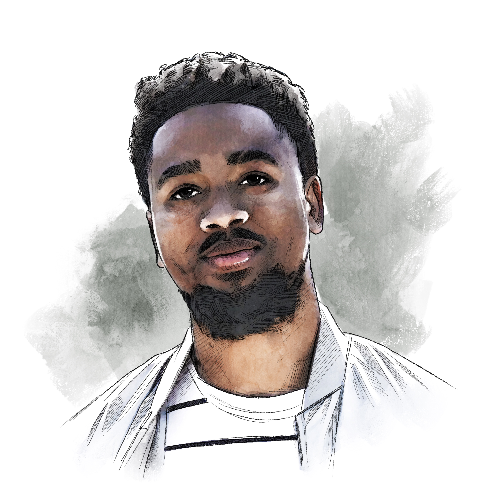
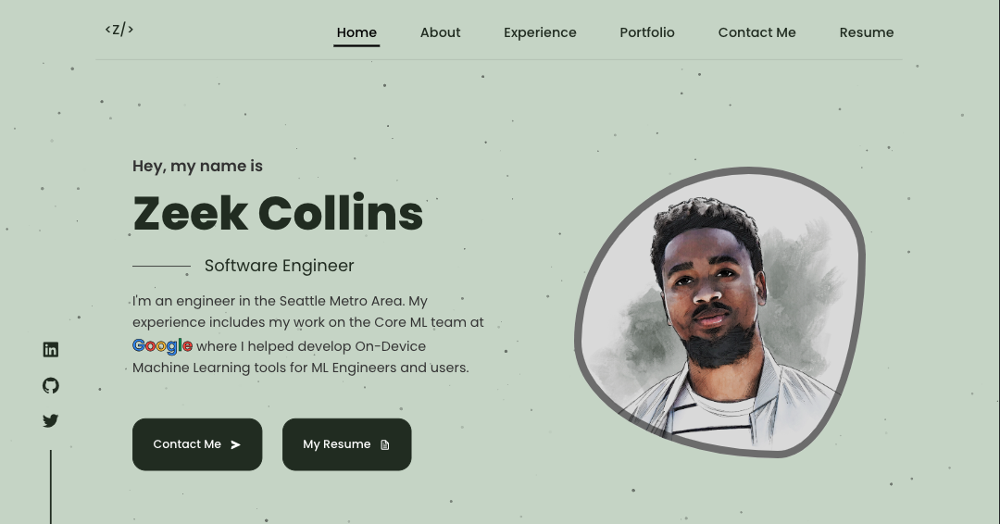

<h1 align="center">
  

My Portfolio Website - v2

</h1>

<h4 align="center">
  This is the second iteration of my single-page personal portfolio website I built and hosted with Netlify to showcase my skills and some of the projects I've developed. 
</h4>
 

##

Vist <a href="https://www.zeekcollins.com">ZeekCollins.com</a> to view my portfolio.

## :eyes: Visuals

  

## :exclamation: About

At the time of creating this site (Spring '24), I am a software engineer with two years of experience at Google. I'm getting ready to start my next opportunity search and figured it'd be a good idea to create an upgraded portfolio site to showcase my growth since the last version. If you have any feedback, it's always welcomed.

## :rocket: Technologies

This project was developed with the following technologies:

- React
- Javascript
- HTML
- CSS

## :green_book: Previous Version

If you're curious, check out my previous portfolio site:

- [v1](https://storied-marzipan-9bf60a.netlify.app/)

---

Made with ♥ by Zeek Collins :wave: [Get in touch!](https://www.linkedin.com/in/ezekialcollinsii/)
